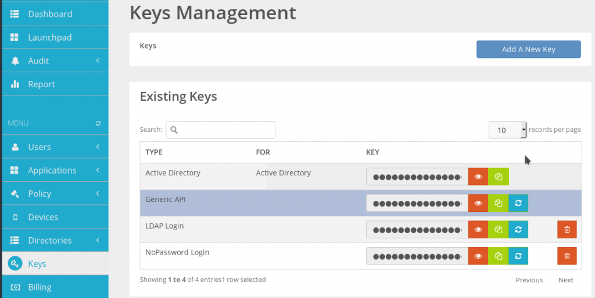
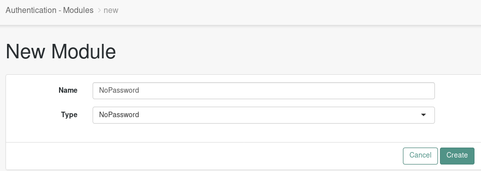
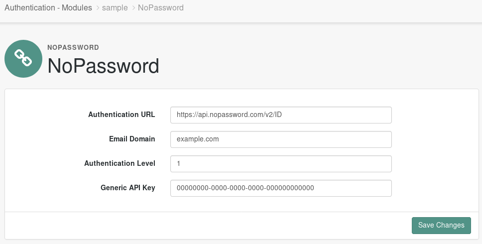
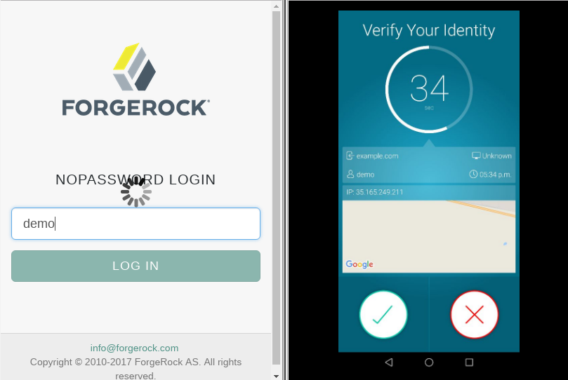

# NoPassword Authentication module

The NoPassword OpenAM Authentication Module allows to ForgeRock users to integrate their AM instance to the NoPassword authentication services.
This document assusmes that you already have an AM 5.5+ instance running with an user base configured.

## Installation

Follow this steps in order to install the module:

1. Download the jar file from [here](taget/nopassword-openam-auth-module-1.0.jar).
2. Copy the **nopassword-openam-auth-module-1.0.jar** file on your server: `/path/to/tomcat/webapps/openam/WEB-INF/lib`
3. Restart AM.
4. Login into NoPassword admin portal and open the `Keys` menu on the left side. Copy the **Generic API** key value by clicking in the green button and save it for later.

5. Login into AM console as an administrator and go to `Realms > Top Level Real > Authentication > Modules`.
6. Click on **Add Module** button. Name the module NoPassword and select NoPassword module from the Type list.

7. Set the email domain from you organization.
8. Set the Generic API Key. Paste you generic API key from step 4 here.

9. Save changes.
10. You can test the NoPassword authentication module by accesing this URL in your browser `https://**your_AM_server here**/openam/XUI/?realm=/#login/&module=NoPassword`. 
11. Enter your username and hit enter. You should get an authentication request on your phone.

